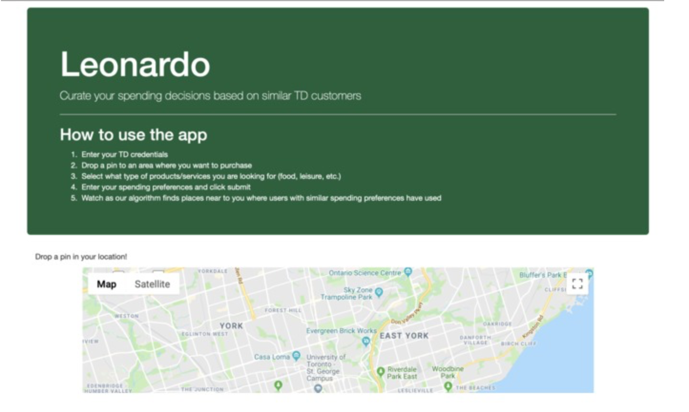
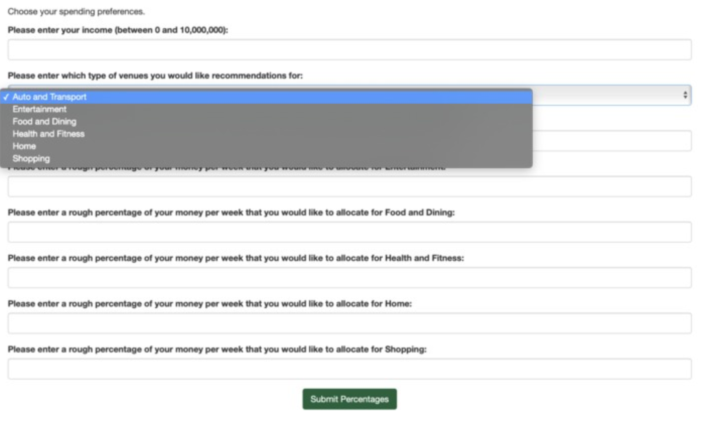
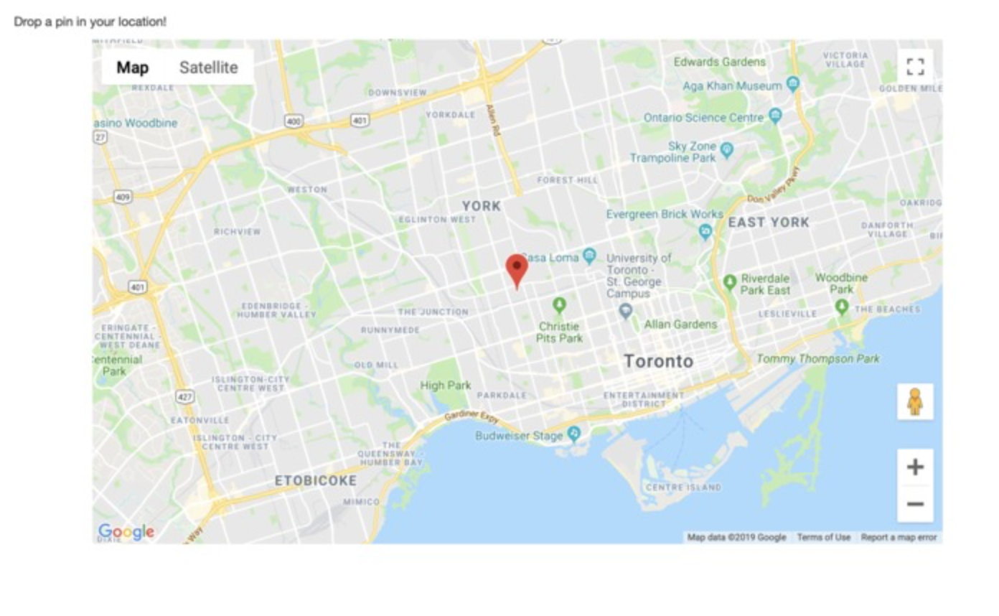
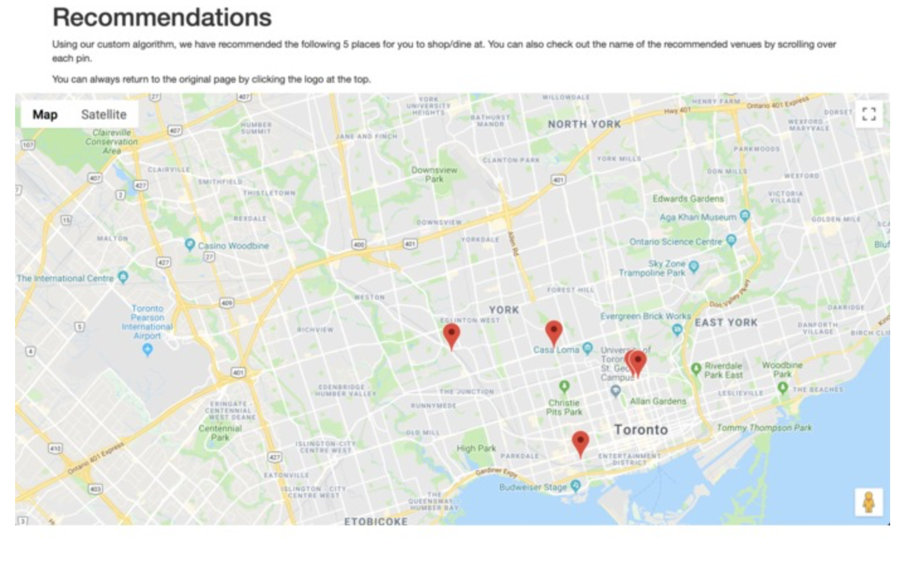

During Hack the North 2019, my team created a web app that recommends shopping places based on budget preferences and locations. Using a Flask web app, we created an interface where users can input the percentage that they allocate for certain budget categories (food, auto, clothes, etc.) and their location. We then used a custom-built KNN-based algorithm that compares the user's budget preferences to over 10,000 virtual budgets from TD's Da Vinci API. Using our algorithm, we can identify customers who share similar budget preferences and recommend shops to teh user based on the shopping habits of virtual customers.

Skills/concepts used:
- Flask web app development
- Data cleaning
- Model building
- API handling

GitHub code can be found [here](https://github.com/aaronabraham311/Leonardo). 

Some pictures:

