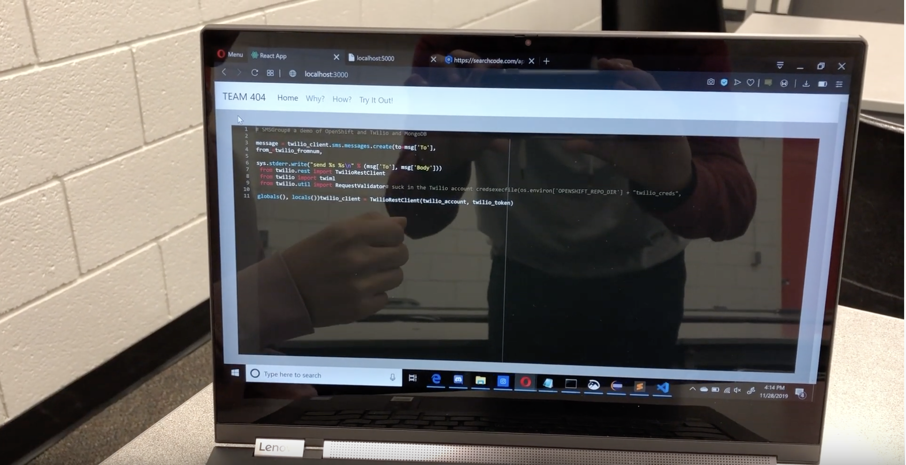

As part of a team of 4 other software engineering students, I helped build a robot that could read pseudocode from a whiteboard and convert it into a real code snippet on a live web editor. I was personally responsible for creating a semantic search system which could map pseudocode to code snippets and integrating the various components of the project (robot hardware, computer vision, semantic search and React web editor).

Skills/concepts used:
- Python object-oriented programming
- API handling
- React

We made a YouTube video showing the entire system! You can watch it [here](https://www.youtube.com/watch?v=Bqk1IHhuxVc)

Some pictures:

